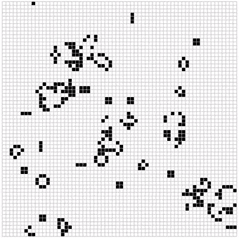

WebAssembly in Haskell ([Try It](https://y-taka-23.github.io/wasm-game-of-life/))
====



A port from a [Rust implementation](https://github.com/rustwasm/book) of Conway's Game of Life.

It's logic of evolution is written in Haskell and compiled to WebAssembly with [Asterius](https://github.com/tweag/asterius). Access [the demo page](https://y-taka-23.github.io/wasm-game-of-life/) or serve the demo locally, and you can see it has around 60 FPS.

Serving Locally
----

```bash
git clone https://github.com/y-taka-23/wasm-game-of-life.git
cd wasm-game-of-life
make start
```
